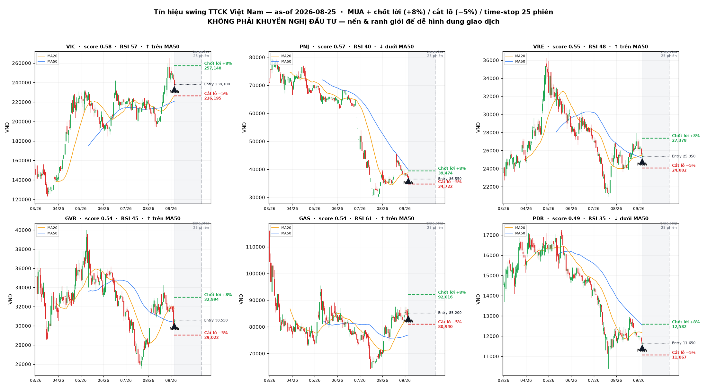
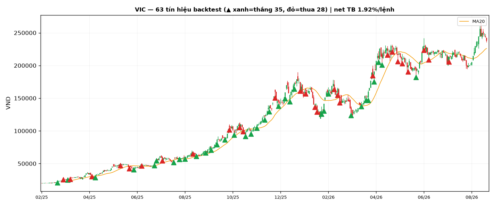

# Kết quả phân tích cơ hội swing — TTCK Việt Nam

> ⚠️ **KHÔNG PHẢI KHUYẾN NGHỊ ĐẦU TƯ — NOT INVESTMENT ADVICE.** Đây là kết quả thực nghiệm của một pipeline machine-learning trên dữ liệu quá khứ. Hiệu suất quá khứ **không** đảm bảo tương lai. Mô hình có thể sai; đừng giao dịch chỉ dựa vào file này.

*Sinh tự động bởi [`run_analysis.py`](../run_analysis.py) — mọi số liệu là kết quả tính thật, out-of-sample. Dữ liệu giá tới 2026-09-14 (vnstock/VCI).*

## 1. Thiết lập

- **Vũ trụ cổ phiếu:** 38 mã thanh khoản (VN30-heavy, nhiều ngành).
- **Dữ liệu:** giá ngày 2018-08-02 → 2026-09-14 (sau khi bỏ ~1 năm đầu để 'làm nóng' chỉ báo); huấn luyện < 2025-01-01, **kiểm định out-of-sample ≥ 2025-01-01**.
- **Lưu ý nhãn:** nhãn triple-barrier cần 25 phiên tương lai để 'chốt', nên backtest OOS chỉ tính được tới **2026-08-05**; ~25 phiên gần nhất (tới 2026-09-14) được **chấm điểm live** ở mục 3 nhưng chưa thể backtest.
- **Định nghĩa 'sóng' (triple-barrier):** vào tại giá đóng cửa; **chốt lời +8%**, **cắt lỗ −5%**, **time-stop 25 phiên (~35 ngày lịch, ~5 tuần)**. Nhãn WIN = chạm chốt lời trước cắt lỗ.
- **Chi phí giao dịch:** 0.3%/vòng (phí+thuế+trượt giá). **Quy tắc vào lệnh:** chỉ giao dịch **top 20% tín hiệu tự tin nhất** mỗi mô hình.
- **Mô hình thử:** Logistic Regression, Random Forest, Gradient Boosting, XGBoost, **LSTM (PyTorch)**.

## 2. So sánh mô hình (out-of-sample)

| Mô hình | AUC | Win-rate | Avg net/trade | Kỳ vọng (R) | Σ P&L (cược cố định) | Max DD | #lệnh |
|---|---|---|---|---|---|---|---|
| **LogReg** | 0.5481 | 0.4215 | 0.37% | 0.074 | 244.96% | -264.99% | 662 |
| XGBoost | 0.5338 | 0.4149 | 0.33% | 0.066 | 220.74% | -213.46% | 670 |
| LSTM | 0.5185 | 0.3955 | 0.20% | 0.041 | 107.96% | -329.48% | 531 |
| RandomForest | 0.5379 | 0.4028 | 0.04% | 0.009 | 28.37% | -408.17% | 638 |
| GradBoost | 0.5363 | 0.3919 | -0.03% | -0.005 | -17.02% | -438.55% | 666 |

- **Base win-rate** (vào mọi phiên, không lọc) trên tập kiểm định: **0.357** (breakeven ≈ 0.385 do R:R = 8:5).
- **Buy & hold** trung bình các mã trong kỳ kiểm định: **39.38%** (tham chiếu, không phải cùng cơ sở rủi ro).
- **Mô hình tốt nhất out-of-sample: `LogReg`** (chọn theo avg net/trade với #lệnh ≥ 20).
- AUC quanh 0.5 nghĩa là sức dự báo yếu — hãy đọc mục *Hạn chế*. Ảnh: [`equity_curve.png`](equity_curve.png), [`model_comparison.png`](model_comparison.png), [`feature_importance.png`](feature_importance.png).

## 3. Tín hiệu swing hiện tại (as-of 2026-09-14)

Điểm `score` = trung bình xác suất WIN của các mô hình (đã retrain trên **toàn bộ** dữ liệu có nhãn). Xếp hạng 38 mã; dưới đây **top 10**. Giá đơn vị VND.

| # | Mã | Ngành | Giá | Score | Chốt lời (+8%) | Cắt lỗ (−5%) | RSI | Trend | Vol× |
|---|---|---|---|---|---|---|---|---|---|
| 1 | **VIC** | RealEstate | 238,100 | 0.5776 | 257,148 | 226,195 | 57 | ↑ trên MA50 | 0.19 |
| 2 | **PNJ** | Retail/Consumer | 36,550 | 0.5704 | 39,474 | 34,722 | 40 | ↓ dưới MA50 | 0.49 |
| 3 | **VRE** | RealEstate | 25,350 | 0.5474 | 27,378 | 24,082 | 48 | ↑ trên MA50 | 0.39 |
| 4 | **GVR** | Materials | 30,550 | 0.5433 | 32,994 | 29,022 | 45 | ↑ trên MA50 | 0.34 |
| 5 | **GAS** | Energy | 85,200 | 0.5352 | 92,016 | 80,940 | 61 | ↑ trên MA50 | 0.62 |
| 6 | **PDR** | RealEstate | 11,650 | 0.4908 | 12,582 | 11,067 | 35 | ↓ dưới MA50 | 0.36 |
| 7 | **FRT** | Retail/Consumer | 135,800 | 0.4677 | 146,664 | 129,010 | 47 | ↑ trên MA50 | 0.20 |
| 8 | **SSI** | Securities | 20,300 | 0.4635 | 21,924 | 19,285 | 47 | ↑ trên MA50 | 0.38 |
| 9 | **NLG** | RealEstate | 24,000 | 0.448 | 25,920 | 22,800 | 49 | ↑ trên MA50 | 0.68 |
| 10 | **FPT** | Technology | 72,800 | 0.4452 | 78,624 | 69,160 | 56 | ↑ trên MA50 | 0.29 |

**Cách đọc / kế hoạch giao dịch (rule-based):**
- **Thời gian vào hàng:** các mã score cao ở trên, ưu tiên mã *trên MA50* (xu hướng lên) và RSI chưa quá nóng (<70). Vào ở phiên kế tiếp, hoặc chờ nhịp chỉnh về vùng MA20 để giá vào tốt hơn.
- **Thời gian ra hàng (chốt lời):** thoát khi **chạm +8%** (mục tiêu chốt lời), hoặc **cắt lỗ tại −5%**, hoặc **hết 25 phiên (~5 tuần)** thì thoát theo giá thị trường. Trong backtest, thời gian giữ trung bình ≈ 6.5 phiên.
- **Khung 3 tháng:** với time-stop ~5 tuần, một mã có thể cho **2–3 nhịp sóng** trong 3 tháng tới (từ 2026-09-14 đến ~2026-12-14). Danh sách nên **cập nhật lại hàng tuần** khi có dữ liệu mới.
- Bảng máy đọc: [`signals_latest.csv`](signals_latest.csv). Backtest chi tiết: [`backtest_trades_LogReg.csv`](backtest_trades_LogReg.csv), so sánh: [`model_metrics.csv`](model_metrics.csv).

## 4. Biểu đồ nến (dễ nhìn giao dịch)

Tạo/cập nhật bằng `python plot_signals.py` (matplotlib thuần). Mỗi chart gồm: nến OHLC, MA20/MA50, **▲ điểm MUA**, ranh giới **chốt lời +8% (xanh nét đứt)** / **cắt lỗ −5% (đỏ nét đứt)**, và vạch **time-stop 25 phiên** — nhìn phát thấy ngay vào ở đâu, chốt/cắt ở đâu.

*Tổng quan top 6 tín hiệu.* Chart từng mã: [`VIC`](charts/VIC_setup.png), [`PNJ`](charts/PNJ_setup.png), [`VRE`](charts/VRE_setup.png), [`GVR`](charts/GVR_setup.png), [`GAS`](charts/GAS_setup.png), [`PDR`](charts/PDR_setup.png).

**Quy tắc chạy thật trong quá khứ** — VIC: mỗi ▲ là một điểm mô hình từng ra tín hiệu (**xanh = thắng**, chạm +8% trước; **đỏ = thua**), theo đúng luật TP/SL/time-stop:

## 5. Hạn chế & cảnh báo (đọc kỹ)

- **Sức dự báo có giới hạn:** giá cổ phiếu gần ngẫu nhiên ngắn hạn; AUC thường chỉ nhỉnh hơn 0.5. Lợi thế (nếu có) đến từ *lọc xác suất* + quản trị rủi ro (R:R, time-stop), không phải 'tiên tri'.
- **Chưa mô phỏng đầy đủ thực tế:** chưa tính biên độ trần/sàn ±7% (HOSE), thanh khoản/khe hở giá, trượt giá lớn khi bán tháo, T+2 (không bán ngay trong ngày), thuế cổ tức, hay giới hạn margin/call.
- **Rủi ro overfitting & regime change:** tham số TP/SL/horizon do người đặt; thị trường 2025–2026 (nâng hạng FTSE, KRX, margin kỷ lục) có thể đổi 'chế độ' làm mô hình quá khứ mất hiệu lực.
- **Không xét cơ bản/định giá/tin tức** — thuần kỹ thuật. Hãy kết hợp khung phân tích cơ bản ([`../docs/03`](../docs/03-phuong-phap-phan-tich-co-ban.md)) và bản đồ rủi ro ([`../docs/05`](../docs/05-rui-ro-va-nguon-du-lieu.md)).
- **Đây là công cụ nghiên cứu/giáo dục.** Quyết định đầu tư là của bạn; cân nhắc tư vấn chuyên môn được cấp phép.

*Chạy lại: `cd analysis && python run_analysis.py`. Tạo lúc dữ liệu 2026-09-14.*
